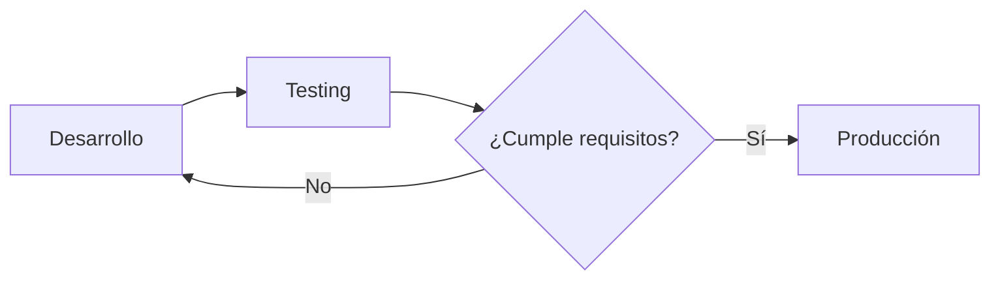

@ingroup apuntes-teoria
IAntes de empesar, obsidian crea notas en formato #MARKDOWN  como las presentaciones que ahi en #GitHub.
### Tutos
- [Alinear Texto](https://www.youtube.com/watch?v=aUQw15mAuis)
***
## Temas Basicos

# Titulo Nivel 1(# )
## Titulo Nivel 2 (## )
### Titulo Nivel 3(### )
#### Etc... .. .

#Etiqueta(#)
*italica*( * * )
**Negritas**( ** ** )

==Subrayar de color== ( == == )

<center>Centrar con HTML</center>
___
Tres veces Guion medio y enter para dividir ( ___ o *** )
***
### Nota Ctrl+Shift+B
<div class="myNota-conteiner"><h4 class="myNota-title">NOTA</h4><p class="myNota-text">Esta nota es un ejemplo de notasaaaaaaaaaaaaaaaaaaaaaaaaaaaaaaaaaaaaaaaaaaaaaaaaaaaaaaaaaaaaaaaaaaaaaaaaaaaaaaaaaaaaaaaaaaaaaaaaaaaaaaaaaaaa</p></div>

<div class="ia-response">
  <div class="ia-header">
	  <div class="ia-conteiner-header-text">
	 <svg class="ia-logo" xmlns="http://www.w3.org/2000/svg" width="28" height="28" viewBox="0 0 14 14"><path fill="#7a5af5" fill-rule="evenodd" d="M4.382.824c.798 0 1.513.357 1.993.92v4.563c-.017.205-.133.633-.4 1.023c-.265.385-.635.678-1.144.734a.625.625 0 1 0 .139 1.243a2.7 2.7 0 0 0 1.405-.585v3.67a2.997 2.997 0 0 1-5.336-1.389c.114-.351.3-.654.478-.795a.625.625 0 1 0-.775-.98a2 2 0 0 0-.259.244A5.65 5.65 0 0 1 0 7.234c0-.974.312-1.931.822-2.636c.11.213.242.4.384.562c.369.42.83.692 1.189.774a.625.625 0 0 0 .277-1.219c-.057-.013-.298-.119-.527-.38c-.184-.21-.343-.5-.382-.89v-.003A2.62 2.62 0 0 1 4.382.824m5.615 12.732a3 3 0 0 1-2.372-1.164V6.548c.256.186.528.338.792.45a.625.625 0 1 0 .486-1.153c-.553-.233-1.062-.685-1.24-1.1l-.038-.074V1.744a2.618 2.618 0 0 1 4.596 1.982l.002.001c-.063.41-.23.788-.41.965a.625.625 0 1 0 .878.89a2.5 2.5 0 0 0 .557-.883c.468.693.752 1.606.752 2.535c0 1.09-.39 2.394-1.01 3.066l-.023-.001a1.7 1.7 0 0 1-.476-.11c-.363-.136-.801-.42-1.183-.975a.625.625 0 1 0-1.03.71c.53.77 1.178 1.211 1.773 1.435c.265.1.531.16.778.183a3 3 0 0 1-2.832 2.014" clip-rule="evenodd"/></svg>
    <h5 class="ia-title">Generado con IA</h5></div><h6 class="ia-type">DeepSeek</h6>
  </div>
  <div class="ia-content">
      `Example`
  </div>
</div>

....
ia:dp
title:"Explicación del Teorema de Pitágoras"
En un triángulo rectángulo:
$$ a^2 + b^2 = c^2 $$
- Donde:
  - $c$ = hipotenusa
  - $a$ y $b$ = catetos
....
## Imagenes

### Arrastar desde Google(Internet)

![[free-linux-logo-icon-download-in-svg-png-gif-file-formats--technology-social-media-company-vol-4-pack-logos-icons-2944967.webp]]
## Arrastar desde Nuestro Gestor de Archivos(offline)
![[Windows_logo_-_2012.svg.png]]
## Redimencionar Imagenes

![[png-transparent-computer-icons-freebsd-bsd-daemon-freebsd-icon-monochrome-black-smile.png|150]]

![[png-transparent-computer-icons-freebsd-bsd-daemon-freebsd-icon-monochrome-black-smile.png|150x400]]

## PDF
ahí Bugs.. .

![[FreeBsd.pd]]
## Sonidos

![[MacStartup.mp3]]

## Videos

![[Procedural Spider-Bot Animation.mp4]]
***
## Crear Ecuaciones

Para escribir Ecuaciones se usa un formalismo llamado latex, tambien lo usa **ChatGPT,DeepSeek,Gemmini,etc... .. .** ($ $ mi ecuacion $ $)

	$$ \nabla \cdot \mathbf{E} = \frac{\rho}{\epsilon_0} $$

## Conectar Notas
[[Capitulo_9]]

## Crear Tablas
#ComunityPlugin #AdvancedTables
[GitHub](https://github.com/tgrosinger/advanced-tables-obsidian?tab=readme-ov-file)
Pasos
***Nota***
- Pasos
	**1.** |Escribe asi para crear una columna|
	**2.** preciona la tecla **TAB**
	**3.** Enter para bajar de fila

- *No Funciona TAB*
	Si tu tecla TAB indenta tus notas en vez de inicializar la tabla... Botón "tres puntos verticales" en la esquina superior derecha de tu nota > Activar "Modo Fuente" o "Source Mode". Con eso al dar TAB sus tablas se iniciarán.

- Teclas
		tab Derecha
		Shift+Tab Izquierda
		Enter Baja

#### Ejemplo

| Columna 1 | Columna2 | Columna3 |
|:---------:|:--------:|:--------:|
|  fila 1   |  Fila 1  |  Fila 1  |
|  Fila 2   |  Fila 2  |  Fila 2  |
|  Fila 3   |  Fila 3  |  Fila 3  |
[Como Usar Advanced Table](https://www.youtube.com/watch?v=_HOnQIIuK1I)

## Crear listas
### No Ordenada
*Se usa (- )*
- item
- item
- item
### Ordenada
*Se usa (num. , por ejemplo 1. )*
1. item
2. item
3. item
### Chek list
Se usa (- [ ] )
- [x] item 
- [ ] item
- [ ] item

### Niveles
Solo Tabulando
- Grandpa
	- father
		- Child
		- Child
		- Child

### Comentar Codigo
#ComunityPlugin #CodeStyler
[GitHub](https://github.com/mayurankv/Obsidian-Code-Styler)
#### Opciones
- fold (Poder Contraerse)
- title: "text" (darle titulo a la contraccion)
- hl: number (Resaltar lineas)

#### Notas 
- Si no vez el los **Iconos y el tipo de lenguaje** ve a Configuracion>Complementos Comunitarios>Configuracion de **CodeStyler**>Choose Codeblock elige Header>[Display header languaje icons](../sources/TrueIconsDEV.mp4) elige Always.
### Inline

`{python icon} printf ('Ejemplo')`
### Full

```js fold title:"Ejemplo de javascript" warn:3 error:7 info:9 {5,14,16,20} 
document.addEventListener('DOMContentLoaded', function() {
document.addEventListener('DOMContentLoaded', function() {

const htmlEditor = document.querySelector('.html-editor');

const javascriptEditor = document.querySelector('.javascript-editor');

const htmlVisualization = document.querySelector('.html-visualization');

const javascriptVisualization = document.querySelector('.javascript-visualization');

  

function actualizarVisualizacion(elementoEditor, elementoVisualizacion, tipo) {

const contenido = elementoEditor.textContent;

elementoVisualizacion.textContent = ''; // Limpiar el contenido anterior antes de agregar nuevo contenido

  

try {

const parser = new DOMParser();

const parsedHTML = parser.parseFromString(contenido, 'text/html');

  

// Agregar el contenido parseado al área de visualización correspondiente

elementoVisualizacion.appendChild(parsedHTML.body.firstChild);

} catch (e) {

// Manejar errores si hay problemas al analizar el HTML o JavaScript

console.error(`Error al analizar el ${tipo}:`, e);

}

}
```

##### Segundo Ejemplo

```js fold title:"Ejemplo de javascript" 
document.addEventListener('DOMContentLoaded', function() {

const htmlEditor = document.querySelector('.html-editor');

const javascriptEditor = document.querySelector('.javascript-editor');

const htmlVisualization = document.querySelector('.html-visualization');

const javascriptVisualization = document.querySelector('.javascript-visualization');

  

function actualizarVisualizacion(elementoEditor, elementoVisualizacion, tipo) {

const contenido = elementoEditor.textContent;

elementoVisualizacion.textContent = ''; // Limpiar el contenido anterior antes de agregar nuevo contenido

  

try {

const parser = new DOMParser();

const parsedHTML = parser.parseFromString(contenido, 'text/html');

  

// Agregar el contenido parseado al área de visualización correspondiente

elementoVisualizacion.appendChild(parsedHTML.body.firstChild);

} catch (e) {

// Manejar errores si hay problemas al analizar el HTML o JavaScript

console.error(`Error al analizar el ${tipo}:`, e);

}

}
```

##### Tercer Ejemplo

```js
document.addEventListener('DOMContentLoaded', function() {

const htmlEditor = document.querySelector('.html-editor');

const javascriptEditor = document.querySelector('.javascript-editor');

const htmlVisualization = document.querySelector('.html-visualization');

const javascriptVisualization = document.querySelector('.javascript-visualization');

  

function actualizarVisualizacion(elementoEditor, elementoVisualizacion, tipo) {

const contenido = elementoEditor.textContent;

elementoVisualizacion.textContent = ''; // Limpiar el contenido anterior antes de agregar nuevo contenido

  

try {

const parser = new DOMParser();

const parsedHTML = parser.parseFromString(contenido, 'text/html');

  

// Agregar el contenido parseado al área de visualización correspondiente

elementoVisualizacion.appendChild(parsedHTML.body.firstChild);

} catch (e) {

// Manejar errores si hay problemas al analizar el HTML o JavaScript

console.error(`Error al analizar el ${tipo}:`, e);

}

}
```


### Mapa Conceptual
```markmap
# Mis Proyectos
## Personal
- Aprender Obsidian
- Hacer ejercicio
## Trabajo
- Informe Q3
- Reunión equipo
```

### Mapa de flujo

***
Para mas Info [Obsidian Help](https://help.obsidian.md)