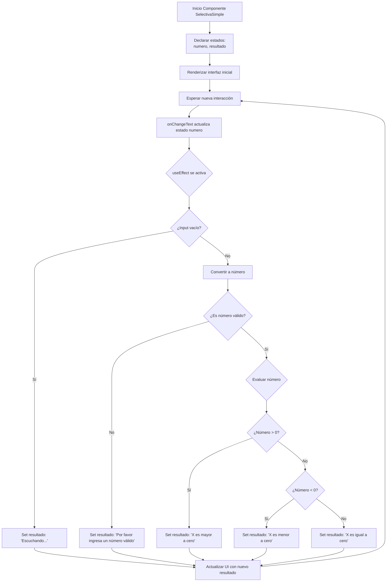

## Explicación del diagrama:

1. **Inicio del componente**: Se inicializan los estados `numero` (string) y `resultado` ("Escuchando...").

2. **Renderizado inicial**: Se muestra la interfaz con el título, descripción, campo de entrada y área de resultado.

3. **Interacción del usuario**: Cuando el usuario escribe en el TextInput, se activa el evento `onChangeText`.

4. **Actualización de estado**: El estado `numero` se actualiza con el valor ingresado.

5. **Efecto secundario**: El `useEffect` se ejecuta automáticamente al cambiar `numero`.

6. **Validaciones**:
   - Si el input está vacío → "Escuchando..."
   - Si no es número válido → Mensaje de error
   - Si es número válido → Evalúa si es mayor, menor o igual a cero

7. **Actualización de UI**: El resultado se muestra en la interfaz y el componente espera nueva interacción.

Este diagrama representa el flujo unidireccional típico de React: interacción → actualización de estado → re-renderizado.